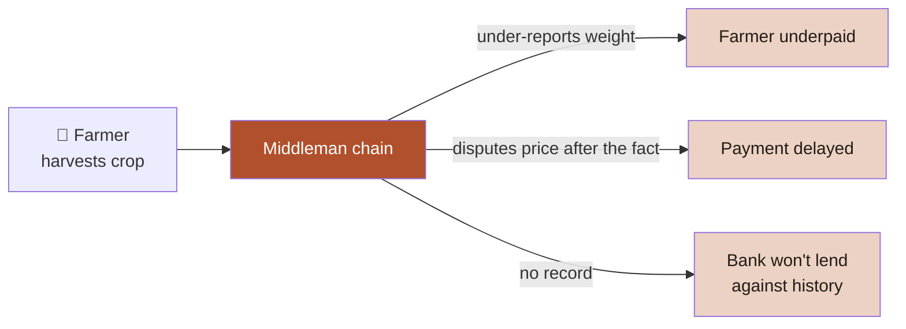
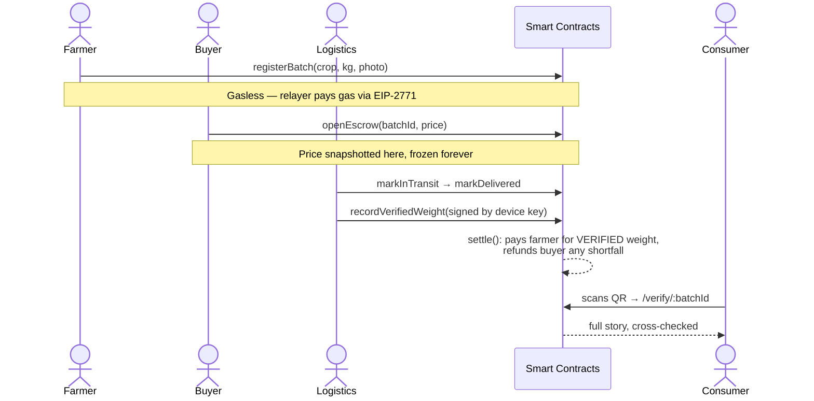
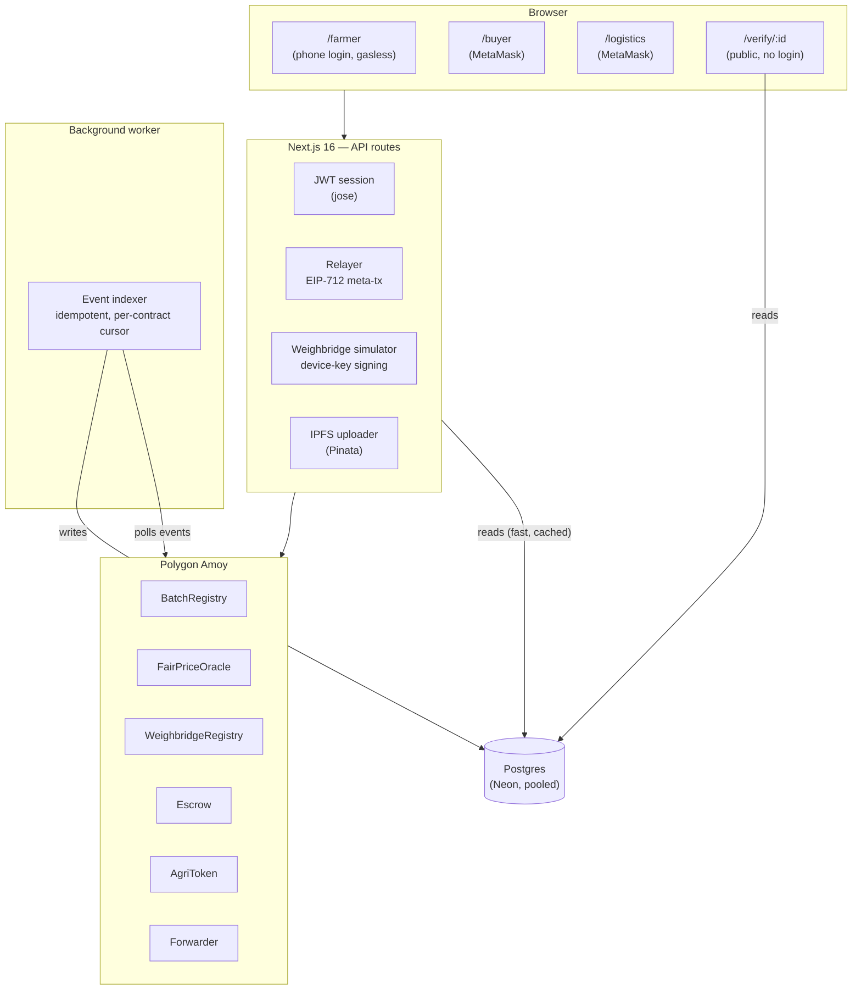
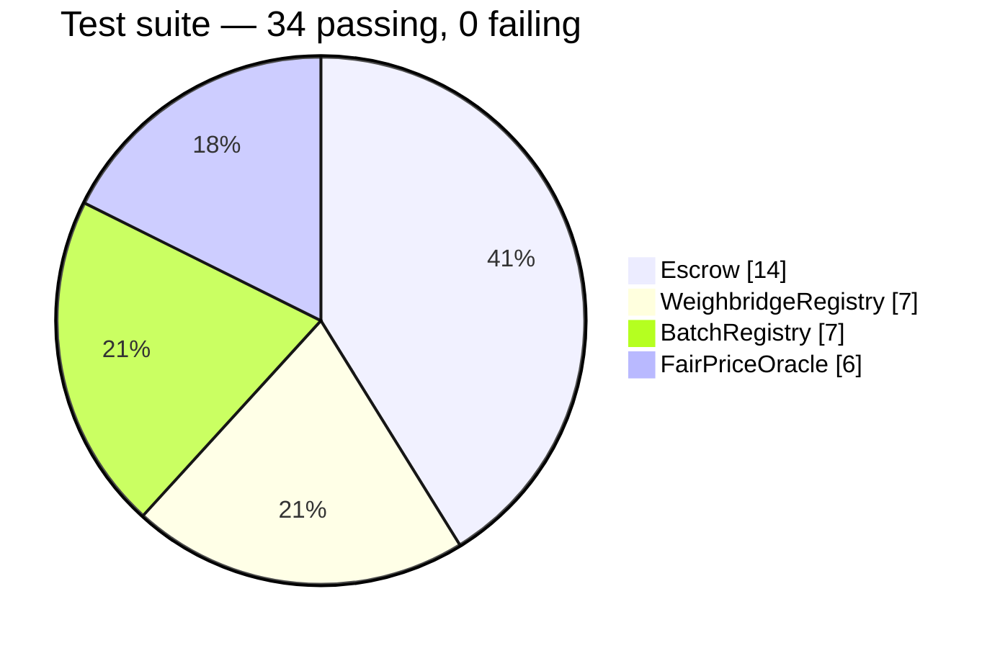

# AgriChain

**Batch se bhugtan tak, sab chain par.** A mandi transaction ledger where weight can't be faked, price can't be argued, and payment can't be delayed — built on Polygon Amoy for $0 running cost.

---

## The problem, in one picture



AgriChain replaces the chain of middlemen with a chain of blocks — the same mandi transaction, but every step is written once, signed by whoever attested it, and nobody can quietly edit it afterward.

## The three promises

| Promise | How it's actually enforced |
|---|---|
| 🏋️ **Weight can't be faked** | A weighbridge device signs its own reading with its own private key. The app server that runs this website never holds that key — a compromised backend still can't forge a number. |
| 💰 **Price can't be argued** | The price is read from the oracle and **frozen into the escrow** the moment a buyer commits — before pickup. Nothing can move it after that, not even an admin. |
| ⏱️ **Payment can't be delayed** | A verified weight reading automatically releases the farmer's payment via smart contract. No phone calls, no "agle hafte." |

## How a batch moves through the system



Every batch's live position in this pipeline is visible on `/verify/:batchId` and every dashboard — not just a status label, an actual step tracker:

```
Registered → Escrowed → In Transit → Delivered → Weighed → Settled
    ●            ●            ●            ●          ◐         ○
```

## Architecture



**Why an indexer at all?** Reads never touch RPC — every page loads from Postgres in under 200ms. The chain stays the single source of truth; the database is just a fast mirror of it.

## What's real vs. what we say out loud

Every "trust" claim in this README has a matching honest caveat — we'd rather you read it here than discover it in Q&A:

- **"Weight can't be faked" → really means "un-forgeable without the device key."** A physically tampered device can still misreport. That's a hardware problem, not a contract one.
- **"Price can't be argued" → one trusted feed for this demo.** Not a decentralized oracle network. That's the production path, not what's running today.
- **Farmer wallets are custodial.** Keys are AES-256-GCM encrypted server-side. A deliberate UX-over-decentralization tradeoff for a feature-phone audience — not free.
- **AGRI is a demo ERC20**, not real INR. Production path: UPI payout via a payment aggregator.

Full writeup in [`PLAN.md` §3](./PLAN.md#3-honest-framing-say-these-out-loud-in-the-pitch).

## Smart contracts



| Contract | Job | Real fix vs. the naive design |
|---|---|---|
| `BatchRegistry.sol` | Batch lifecycle state machine | Farmer registers via `ERC2771Context` — gasless |
| `FairPriceOracle.sol` | Daily price feed | Jump-guard flags >20% moves without blocking them |
| `WeighbridgeRegistry.sol` | Signed weight readings | ECDSA-verified on-chain against a device key the app never holds |
| `Escrow.sol` | Holds funds, releases on weight | **Price snapshot at open** (can't be moved after) + **pays for verified weight, not registered quantity** — both regression-tested against the exploit they close |
| `Forwarder.sol` | Gasless relay | Wraps OpenZeppelin's audited `ERC2771Forwarder`, no custom relay logic |
| `AgriToken.sol` | Demo settlement token | — |

## Build status

```mermaid
gantt
    title Build phases
    dateFormat X
    axisFormat %s
    section Done
    P0 Repo scaffold            :done, 0, 1
    P1 Contracts + 34 tests     :done, 1, 2
    P2 Backend services         :done, 2, 3
    P3 Frontend, all 7 pages    :done, 3, 4
    P4 Local E2E verified       :done, 4, 5
    section Blocked on you
    Live Amoy run               :active, 5, 6
```



| Phase | Status |
|---|---|
| P0 — Repo scaffold | ✅ Done |
| P1 — Smart contracts | ✅ Done — 34/34 tests, incl. 2 exploit-regression tests |
| P2 — Backend (indexer, relayer, weighbridge sim, IPFS) | ✅ Code done |
| P3 — Frontend, all 7 pages | ✅ Done |
| P4 — End-to-end verified locally | ✅ Verified against a **live** local chain, not just reasoned about |
| Live on public Amoy testnet | ⏳ Needs a funded wallet + your Neon/Pinata accounts |

Full detail in [`CHECKLIST.md`](./CHECKLIST.md).

## Tech stack

| Layer | Choice |
|---|---|
| Contracts | Solidity 0.8.26, Foundry, OpenZeppelin |
| Chain | Polygon Amoy testnet |
| Frontend | Next.js 16, TypeScript, Tailwind v4, viem |
| Backend | Next.js API routes, `tsx` worker scripts |
| Database | Neon Postgres (serverless, pooled) + Drizzle ORM |
| Storage | Pinata (IPFS) |
| Auth | Lightweight JWT session (`jose`) + `window.ethereum` |

## Running it

```bash
# 1. Contracts
cd contracts
cp .env.example .env   # fill in AMOY_RPC_URL, DEPLOYER_PRIVATE_KEY, role addresses
forge test               # 34 tests
forge script script/Deploy.s.sol --rpc-url amoy --broadcast

# 2. App
cd app
cp .env.example .env.local   # fill in contract addresses, DATABASE_URL, PINATA_JWT, keys
npm install
npm run db:migrate
npm run seed

# 3. Run
npm run indexer   # terminal 1
npm run dev         # terminal 2
```

---
